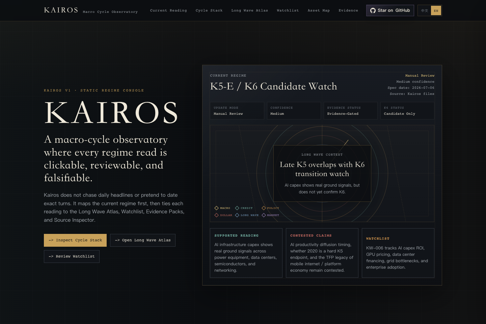
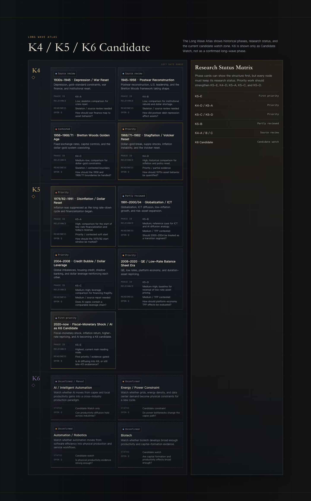
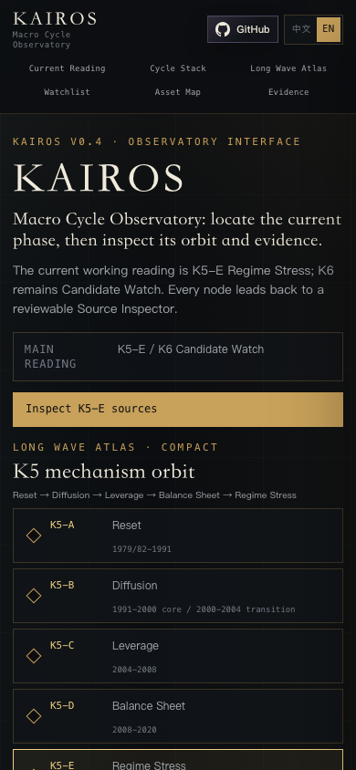

# Kairos · Macro Cycle Observatory

**English** | [简体中文](README.zh-CN.md)

**Kairos** is a public macro-cycle observatory for regime readings, long-wave context, watchlists, asset implications, and evidence-gated validation.

Chinese name: **周期天象图**  
English subtitle: **Macro Cycle Observatory**

Public repository: **kairos-atlas**  
Planned website domain: **kairos-atlas.com**

`kairos-atlas` is the public repository and domain identity. `Macro Cycle Observatory` remains the product subtitle because the site is designed as an observatory-style macro dashboard, while the Atlas name anchors the public URL and the Long Wave Atlas concept.

Kairos is designed to make macro-cycle judgment more inspectable: every major reading should remain clickable, reviewable, and falsifiable.

## Why Kairos Exists

Long-wave and macro-cycle history is rich, but the useful material is scattered across books, papers, market frameworks, financial history, policy records, and current data. Many Kondratiev-style cycles look different on the surface, yet they often rhyme at the structural level:

- credit expansion and refinancing pressure;
- technology diffusion and capital expenditure booms;
- monetary regime shifts and fiscal shocks;
- inflation waves, dollar liquidity, and asset repricing;
- speculative finance, fragility, and eventual validation or falsification.

Kairos is an attempt to organize those recurring structures into a public macro-cycle weather map: not a date oracle, not a trading signal system, but a learning and observation layer for comparing historical regimes with the present.

## Research Foundation

Kairos draws from a private theoretical reading base that synthesizes long-wave theory, debt-cycle analysis, financial instability theory, monetary history, and asset-regime frameworks.

The public release is influenced by research traditions associated with Schumpeter, Minsky, Kindleberger, Dalio, Howard Marks, Bordo and Eichengreen, Hélène Rey, Merrill Lynch's Investment Clock, and Chinese long-wave cycle literature.

The private reading notes are not included in this public repository. They are used as a research foundation, while the public site exposes only curated structure, current watch items, evidence status, and falsifiable judgment boundaries.

## Research Lineage

Kairos compresses its theoretical base into a few public-facing lenses:

| Lineage | Representative sources / traditions | How it informs Kairos |
|---|---|---|
| Long waves and innovation cycles | Schumpeter; Chinese long-wave cycle research, including Zhou Jintao | Frames K4 / K5 / K6 candidate phases and the question of technology diffusion. |
| Debt cycles and crisis mechanics | Ray Dalio; Minsky; Kindleberger / Aliber / McCauley | Separates hedge finance, speculative finance, fragility, mania, panic, and reset dynamics. |
| Market cycles and asset behavior | Howard Marks; Merrill Lynch Investment Clock; asset-regime research | Links macro regimes to asset behavior without turning the site into trading advice. |
| Monetary regimes and dollar liquidity | Bordo / Eichengreen; Eichengreen; Yoichi Funabashi; Hélène Rey | Connects Bretton Woods, gold constraints, global dollar liquidity, and cross-border financial cycles. |
| Economic history and business-cycle synthesis | DeLong; Tvede; Ellis / Goldman-style forecasting frameworks | Keeps historical comparison grounded in recurring structures rather than narrative analogy alone. |
| Gold and monetary trust | Erb / Harvey; monetary-history literature | Treats gold as a changing regime signal, not a single-factor real-rate instrument. |

This lineage is a map of influence, not a public archive of notes. The public repository keeps the synthesis and judgment scaffolding; the extracted private notes remain outside the release package.

## Watchlist Highlights

- **AI as K6 Candidate**: AI may become a new long-wave diffusion engine, but it must remain `Candidate Watch` until evidence supports broad productivity diffusion.
- **AI capex financing fragility**: hyperscaler capex can still be supported by strong cash flow, while independent GPU cloud and data-center financing deserve a separate fragility watch.
- **High real rates**: the post-2020 rate regime may challenge the low-rate asset-pricing system, but this remains a live question rather than a completed verdict.
- **Loose financial conditions under high rates**: high policy rates do not automatically imply tight financial conditions; credit spreads, liquidity, and risk appetite still matter.
- **Gold and fiat-credit hedging**: gold may be shifting from a simple real-rate asset toward a broader fiat-credit hedge, but the public source base still needs strengthening before the claim becomes supported.

See [`research/`](research/) for curated public research briefs.

## Screenshots



| Long Wave Atlas | Mobile reading |
|---|---|
|  |  |

## What Kairos Shows

- **Current Regime**: the current macro-cycle weather map.
- **Cycle Stack**: a six-layer view of macro clock, credit cycle, liquidity / policy, global dollar, long-wave context, and market validation.
- **Long Wave Atlas**: K4 / K5 historical phases and K6 Candidate Watch.
- **Watchlist**: observations that could change the current reading.
- **Asset Behavior Map**: regime implications across major asset groups.
- **Evidence Ledger**: supported, contested, unconfirmed, evidence gaps, and validation notes.

## What Kairos Is Not

Kairos is not:

- a date oracle;
- a trading signal system;
- investment advice;
- a promise that K6 has been confirmed;
- a news feed that automatically updates macro judgments.

## Product Guardrails

- **K6 remains Candidate Watch**, not confirmed K6.
- Watchlist items are observations, not confirmed facts.
- Contested claims must remain visibly contested.
- Partial / source-review material must not be presented as fully supported.
- Macro readings should preserve evidence status, confidence, related watch items, and kill criteria.

## Public Release Scope

This public release repository is intentionally curated.

It includes:

- the public website entry file;
- public-facing README files;
- curated public research briefs;
- public release metadata;
- content licensing notes.

It does **not** include the private research workspace, internal BRDs, theoretical notes, raw evidence packs, AI collaboration context, or internal build logs.

## Local Preview

From this folder:

```bash
python3 -m http.server 8765
```

Open:

```text
http://127.0.0.1:8765/index.html
http://127.0.0.1:8765/index.html?lang=en
```

## Repository Structure

```text
.
├── index.html
├── README.md
├── README.zh-CN.md
├── LICENSE
├── LICENSE-CODE-MIT
├── CONTENT_LICENSE.md
├── PUBLIC_RELEASE_MANIFEST.md
├── .gitignore
├── assets/
└── research/
```

## License

Kairos uses a split license model:

- **Website implementation code**: MIT License. See `LICENSE-CODE-MIT`.
- **Kairos content and research framing**: all rights reserved. See `CONTENT_LICENSE.md`.

Because `index.html` contains both implementation code and Kairos content, the MIT License applies only to the implementation code portions. It does not grant rights to commercially reuse or republish the Kairos name, 周期天象图 name, macro-cycle framing, website copy, regime descriptions, Watchlist language, Evidence Ledger wording, or research interpretation.

## Language

The website supports Chinese and English modes. The GitHub repository uses English as the default language for global accessibility, with Chinese documentation provided in `README.zh-CN.md`.
